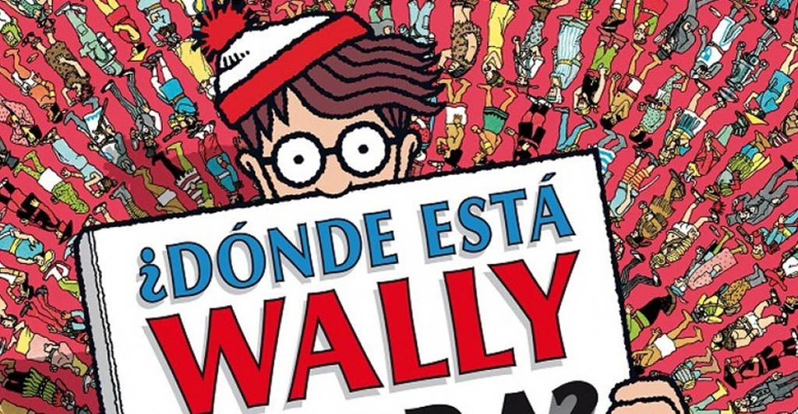
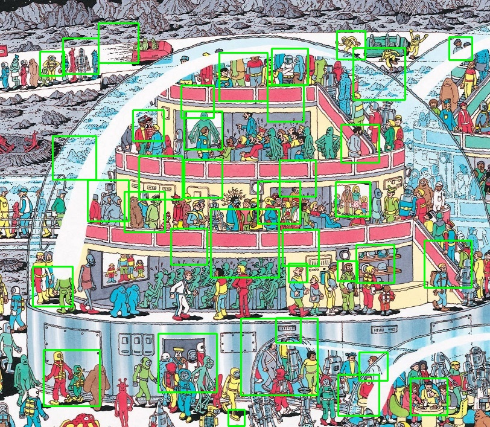

# Actividad: ¿Dónde está Wally?

Como en la actividad anterior, vamos a necesitar varias imágenes, pero ahora son del personaje de Wally, para poder crear una inteligencia artificial que sea capaz de encontrar a Wally en las distintas imágenes donde aparecen muchos personajes entre donde se esconde Wally.

Para eso utilizamos la herramienta de Cascade Trainer para poder generar el archivo XML que utilizara el programa para detectar a los posibles Wally, para eso necesitamos imágenes positivas que son las imágenes donde está Wally e Imágenes negativas en donde no está Wally, esto con la intención de que no tengamos errores al identificar el personaje de Wally, ya que la inteligencia artificial se puede confundir por colores, objetos o personaje de la misma imagen indicando partes de la imagen que no son Wally.

# Proceso de entrenamiento de la inteligencia artificial
Una vez que tengamos las imágenes, debemos tener instalado el Cascade Trainer GUI, una vez instalado debemos de entrar a la pestaña "Train" e "Input" en el campo "Samples Folder" ponemos la carpeta que contenga las carpetas separadas por imágenes positivas y negativas, luego indicamos el porcentaje de imágenes positivas que se van a usar en mi caso fue 80 porciento, luego en el campo de conteo de imágenes negativas ponemos 1020 dependiendo de la cantidad de imágenes que tengas.

[Enlace a Cascade Trainer Gui](https://amin-ahmadi.com/cascade-trainer-gui/)

Nos dirigimos a la pestaña "Common" solo cambiamos el campo "Number of Stages" cambiamos el valor es recomendable que este por arriba de 10, ya que si es muy bajo el archivo será más pesado, tardará más el programa en encontrar a Wally y puede que solo identifique otras cosas que no sean Wally, una vez configurado le damos clic en "Start" para iniciar el entrenamiento puede llegar a ser tardado y depende de cuanta memoria RAM tengas. Una vez que ya termino el entrenamiento te va a generar una carpeta llamada "classifier" con varios archivos XML el que nos va a importar es el cascade.xml.

# Explicación del código para encontrar a Wally

Importamos las librerías de OpenCV y OS, cargamos el archivo que nos generó el Cascade Trainer llamado "cascade.xml", indicamos la ruta de la imagen que queremos que analice, la revisara en blanco y negro para facilitar la búsqueda de Wally, también para encontrarlo fácilmente podemos cambiar los valores de "minNeighbors" si los valores son muy pequeños marcará varias partes de la imagen indicando que son Wally aunque no tenga sentido, si el valor es más grande marcará menos partes de la imagen, probablemente marque a Wally, pero si no lo marca debemos de bajar el valor hasta encontrar el correcto donde si identifique a Wally.

~~~
import cv2 as cv
import os

wally_cascade = cv.CascadeClassifier(r'C:\Users\Martin\cascade.xml')
 
 

image_path = r'C:\Users\Martin\prueba9.jpg'
 
image = cv.imread(image_path)
 

gray = cv.cvtColor(image, cv.COLOR_BGR2GRAY)
wally_apparitions = wally_cascade.detectMultiScale(gray, scaleFactor=1.01, minNeighbors=41, minSize=(20, 20))
 
 
 

~~~

La siguiente es una condición en la que si en ninguna parte de la imagen no encontró a Wally mandara el mensaje de que Wally no fue encontrado, en caso contario los marcara encerrándolos en un cuadrado verde, generando una imagen indicando la ruta y el nombre de la imagen, mandara mensaje de que sí encontró a Wally.
~~~
if len(wally_apparitions) == 0:
    print("Wally not found")
else:
    for (x, y, w, h) in wally_apparitions:
        cv.rectangle(image, (x, y), (x + w, y + h), (0, 255, 0), 2)
 
    output_path = r'C:\Users\Martin\WallyEncontrado\Encontrado9.jpg'
    cv.imwrite(output_path, image)
 
    print(f"Wally se encontro. Path: {output_path}.")
~~~

La imagen que se genera marca los posibles Wally encerrándolos en cuadrados verdes.

