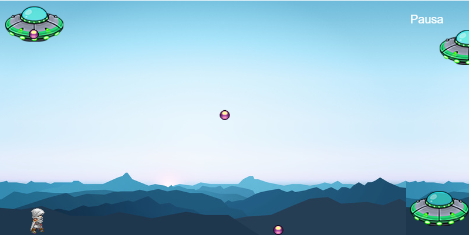

# Actividad Phaser 3 Balas

# Como añadir más balas que el jugador debe esquivar

Se añaden dos naves al juego, la primera arriba del jugador que le dispare desde arriba y la otra en la esquina superior derecha que le dispare en diagonal, ahora el jugador deberá de esquivar esas balas pudiéndose mover a la izquierda y a la derecha sin quitar el salto.

# Cuantas entradas y salidas debe tener la inteligencia artificial
Serían 6 entradas, las primeras 3 son el desplazamiento de cada bala, esta entrada se calcula con la ubicación del jugador en el eje x, restándole la posición de la bola en el eje x.

~~~
despBala = Math.floor(jugador.position.x - bala.position.x);
despBala1 = Math.floor(jugador.position.x - bala1.position.x);
despBala2 = Math.floor(jugador.position.x - bala2.position.x);
~~~
Las otras 3 entradas serían la velocidad de cada bala que se calculan con un número al azar entre 300 a 800 y el número debe de ser negativo para que se pueda desplazar a la izquierda.

~~~
velocidadBala = -1 * velocidadRandom(300, 800);
~~~

Las salidas son 4 que corresponden a las acciones que realiza el jugador si está en el suelo, en el aire, moviéndose a la izquierda o la derecha, estas salidas son banderas que solo pueden tener el valor de 0 y 1 que corresponden a falso y verdadero, solo cambiaran cuando el jugador haga la acción correspondiente.
# Explicación del código

Declaramos las variables que servirán para ajustar la pantalla del juego y las que son fundamentales para el funcionamiento del juego como el jugador, las balas, el menú, y las variables que servirán para guardar los datos que va a aprender la inteligencia artificial como la red neuronal y el arreglo que guardara los datos de entrenamiento, también las banderas que también sirven para la inteligencia artificial, para que pueda ver cuantas veces se presionaron los botones de salto, izquierda y derecha.

~~~
// Declaramos las variables
var w = 800;
var h = 400;
var jugador;
var fondo;

// Variables para las balas y naves
var bala, bala1, bala2, balaD = false, balaD1 = false, balaD2 = false, nave, nave1, terceraNave;

// Variables para el salto, despliegue menu, movimiento izquierda y derecha del personaje
var salto, menu, izquierda, derecha;

// Velocidad de las balas de las naves
var velocidadBala, velocidadBala1, velocidadBala2;
var despBala, despBala1, despBala2;
var estatusAire, estatuSuelo, estatusizquierda, estatusderecha;

// Variables para el entrenamiento de la red neuronal
var nnNetwork, nnEntrenamiento, nnSalida, datosEntrenamiento = [];
var modoAuto = false, eCompleto = false;

// Iniciamos el juego Phaser con el tamaño de las variables indicadas arriba (800x400) y definimos las funciones que están dentro de los paréntesis; preload, create, update, render)
var juego = new Phaser.Game(w, h, Phaser.CANVAS, '', { preload: preload, create: create, update: update, render: render });
~~~

## Función Preload
Esta función se encargará de cargar las imágenes correspondientes al fondo, personaje, naves y balas, para que ya se encuentren dentro del juego.

~~~
function preload() {
    juego.load.image('fondo', 'assets/game/fondo.jpg');
    juego.load.spritesheet('mono', 'assets/sprites/altair.png', 32, 48);
    juego.load.image('nave', 'assets/game/ufo.png');
    juego.load.image('bala', 'assets/sprites/purple_ball.png');
    juego.load.image('menu', 'assets/game/menu.png');
    juego.load.audio('saltosonido', 'assets/audio/jump.mp3');
}
~~~

## Función Create
Esta función ya ingresa los sprites en el juego, los posiciona donde se especifica en las coordenadas y se activan colisiones con los límites de la pantalla, se ingresa el botón de pausa, se configura los botones del teclado y se inicializa la red neuronal con el número de entradas y salidas.

~~~
function create() {
    juego.physics.startSystem(Phaser.Physics.ARCADE);
    juego.physics.arcade.gravity.y = 800;
    juego.time.desiredFps = 30;

    fondo = juego.add.tileSprite(0, 0, w, h, 'fondo');
    nave = juego.add.sprite(w - 100, h - 75, 'nave'); // La nave que dispara en horizontal
    nave1 = juego.add.sprite(w - 790, h - 390, 'nave'); // La nave que dispara en vertical, hacía abajo
    terceraNave = juego.add.sprite(w - 50, 50, 'nave'); // Crear la tercera nave en la esquina superior derecha

    // El personaje
    jugador = juego.add.sprite(50, h - 75, 'mono');
    juego.physics.enable(jugador);
    jugador.body.collideWorldBounds = true;
    var corre = jugador.animations.add('corre', [8, 9, 10, 11]);
    jugador.animations.play('corre', 10, true);

    // Las balas de las naves
    bala = juego.add.sprite(w - 100, h, 'bala');
    juego.physics.enable(bala);
    bala.body.collideWorldBounds = true;

    bala1 = juego.add.sprite(w - 750, h - 350, 'bala');
    juego.physics.enable(bala1);
    bala1.body.collideWorldBounds = true;

    bala2 = juego.add.sprite(w - 50, 50, 'bala');
    juego.physics.enable(bala2);
    bala2.body.collideWorldBounds = true;

    // Menú de pausa
    pausaL = juego.add.text(w - 100, 20, 'Pausa', { font: '20px Arial', fill: '#fff' });
    pausaL.inputEnabled = true;
    pausaL.events.onInputUp.add(pausa, this);
    juego.input.onDown.add(mPausa, this);

    // Teclado
    salto = juego.input.keyboard.addKey(Phaser.Keyboard.SPACEBAR);
    izquierda = juego.input.keyboard.addKey(Phaser.Keyboard.LEFT);
    derecha = juego.input.keyboard.addKey(Phaser.Keyboard.RIGHT);

    // Red neuronal
    nnNetwork = new synaptic.Architect.Perceptron(6, 6, 6, 4);
    nnEntrenamiento = new synaptic.Trainer(nnNetwork);
}
~~~

## Funciones de entrenamiento
Estas funciones sirven para que se pueda entrenar a la inteligencia artificial, tenemos las funciones de "datosdeentrenamiento"  son 3 de estas funciones cada una cuenta las veces que el personaje hace algo como contar las veces que salto, que se movió a la izquierda o derecha, con la intención de que la inteligencia artificial sepa que se debe hacer dependiendo de los valores de entrada que se basan en el movimiento de la pelota, con ese conteo de movimientos se puede entrenar a la red neuronal.

~~~
// Entrenamiento de la red neuronal
function enRedNeural() {
    nnEntrenamiento.train(datosEntrenamiento, { rate: 0.003, iterations: 10000, shuffle: true });
}

function datosDeEntrenamiento(param_entrada) {
    nnSalida = nnNetwork.activate(param_entrada);
    var aire = Math.round(nnSalida[0] * 100);
    var piso = Math.round(nnSalida[1] * 100);
    return nnSalida[0] >= nnSalida[1];
}

function datosDeEntrenamiento1(param_entrada) {
    nnSalida = nnNetwork.activate(param_entrada);
    var derecha = Math.round(nnSalida[2] * 100);
    var izquierda = Math.round(nnSalida[3] * 100);
    return nnSalida[2] >= nnSalida[3];
}

function datosDeEntrenamiento2(param_entrada) {
    nnSalida = nnNetwork.activate(param_entrada);
    var derecha = Math.round(nnSalida[2] * 100);
    var izquierda = Math.round(nnSalida[3] * 100);
    return nnSalida[3] >= nnSalida[2];
}

~~~

## Funciones de pausa y reseteo del juego

Tenemos funciones para cuando se pausa el juego te permita elegir opciones de que el juego se maneje de manera manual o de manera automática especificando coordenadas específicas para que sepa cuál opción se está eligiendo, ya que el menú de pausa es una imagen, cuando sea de cualquiera de las 2 opciones se resetea el juego poniendo todo en su lugar con algunos cambios en la velocidad de las balas.

~~~
// Entrenamiento de la red neuronal
function enRedNeural() {
    nnEntrenamiento.train(datosEntrenamiento, { rate: 0.003, iterations: 10000, shuffle: true });
}

function datosDeEntrenamiento(param_entrada) {
    nnSalida = nnNetwork.activate(param_entrada);
    var aire = Math.round(nnSalida[0] * 100);
    var piso = Math.round(nnSalida[1] * 100);
    return nnSalida[0] >= nnSalida[1];
}

function datosDeEntrenamiento1(param_entrada) {
    nnSalida = nnNetwork.activate(param_entrada);
    var derecha = Math.round(nnSalida[2] * 100);
    var izquierda = Math.round(nnSalida[3] * 100);
    return nnSalida[2] >= nnSalida[3];
}

function datosDeEntrenamiento2(param_entrada) {
    nnSalida = nnNetwork.activate(param_entrada);
    var derecha = Math.round(nnSalida[2] * 100);
    var izquierda = Math.round(nnSalida[3] * 100);
    return nnSalida[3] >= nnSalida[2];
}

~~~

## Funciones de movimiento
Estas funciones se ejecutan con la red neuronal o cuando se presionan los botones correspondientes a cada acción, como saltar, moverse a la izquierda o derecha.

~~~
// Funciones de movimiento del personaje
function saltar() {
    jugador.body.velocity.y = -270;
}

function movIzquierda() {
    jugador.body.velocity.x = -120;
}

function movDerecha() {
    jugador.body.velocity.x = 100;
}
~~~

## Función Update

En esta función es donde la mayor parte del programa funciona y va guardando los datos que se ocupan para enseñarle a la red neuronal que debe de hacer cuando el juego está en modo automático, tenemos los valores iniciales de las banderas de los estados del jugador, las colisiones del personaje y las balas, el disparo de las balas, el modo manual que va a ir cambiando los estados conforme se vayan apretando los botones para controlar el personaje y el modo automático donde el jugador será controlado por la red neuronal con base en los movimientos que hicimos en el modo manual tomando en cuenta los valores de las entradas y salidas que se guardaron antes de cambiar al modo automático.

~~~
function update() {
    //Movimiento del Fondo
    fondo.tilePosition.x -= 1;
    //Colisiones de la bala y el jugador
    juego.physics.arcade.collide(bala, jugador, colisionH, null, this);
    juego.physics.arcade.collide(bala1, jugador, colisionH, null, this);
    juego.physics.arcade.collide(bala2, jugador, colisionH, null, this);
    // Valores iniciales de los estados.
    estatuSuelo = 1;
    estatusAire = 0;
    estatusizquierda = 0;
    estatusderecha = 0;
    // Cambiar estados
    if (!jugador.body.onFloor()) {
        estatuSuelo = 0;
        estatusAire = 1;
    }

    // Disparar balas
    if (balaD == false) {
        disparo();
    }
    if (balaD1 == false) {
        disparo1();
    }
    if (balaD2 == false) {
        disparo2();
    }

    // Resetear balas
    if (bala.position.x <= 0) {
        resetVariables();
    }
    if (bala1.position.y >= 380) {
        resetVariables1();
    }
    if (bala2.position.x <= 0) {
        resetVariables2();
    }

    // Modo Manual
    if (modoAuto == false && salto.isDown && jugador.body.onFloor()) {
        saltar();
    } else if (modoAuto == false && izquierda.isDown) {
        estatusizquierda = 1;
        estatusderecha = 0;
        movIzquierda();
    } else if (modoAuto == false && derecha.isDown) {
        estatusizquierda = 0;
        estatusderecha = 1;
        movDerecha();
    }
    //Desplazamiento de la bala
    despBala = Math.floor(jugador.position.x - bala.position.x);
    despBala1 = Math.floor(jugador.position.x - bala1.position.x);
    despBala2 = Math.floor(jugador.position.x - bala2.position.x);
    //Modo automatico
    if (modoAuto == true && bala.position.x > 0 && jugador.body.onFloor()) {
        if (datosDeEntrenamiento([despBala, velocidadBala, despBala1, velocidadBala1, despBala2, velocidadBala2])) {
            saltar();
        }
    }

    if (modoAuto == true && bala1.position.y > 0) { 
        if (datosDeEntrenamiento1([despBala, velocidadBala, despBala1, velocidadBala1, despBala2, velocidadBala2])) {
            movDerecha();
        }
    }

    if (modoAuto == true && bala2.position.y > 0) {
        if (datosDeEntrenamiento2([despBala, velocidadBala, despBala1, velocidadBala1, despBala2, velocidadBala2])) {
            movIzquierda();
        }
    }

    if (modoAuto == false && bala.position.x > 0 && bala1.position.x > 0 && bala2.position.x > 0) {
        datosEntrenamiento.push({
            'input': [despBala, velocidadBala, despBala1, velocidadBala1, despBala2, velocidadBala2],
            'output': [estatusAire, estatuSuelo, estatusderecha, estatusizquierda]
        });
        console.log("Desplazamiento Bala: " + despBala + " Velocidad Bala: " + velocidadBala + " Salto: " + estatusAire + " Suelo: " + estatuSuelo + " DER: " + estatusderecha + " IZQ: " + estatusizquierda);
    }
}
~~~

## Funciones de las balas
Son funciones que controlan el disparo de las balas como la velocidad y las colisiones con el jugador.

~~~
// Función para el disparo de la primera nave
function disparo() {
    velocidadBala = -1 * velocidadRandom(300, 800);
    bala.body.velocity.y = 0;
    bala.body.velocity.x = velocidadBala;
    balaD = true;
}

// Función para el disparo de la segunda nave
function disparo1() {
    velocidadBala1 = -1 * velocidadRandom(300, 800);
    bala1.body.velocity.x = 0;
    bala1.body.velocity.y = velocidadBala1;
    balaD1 = true;
}

// Función para el disparo de la tercera nave
function disparo2() {
    velocidadBala2 = -1 * velocidadRandom(300, 800);
    bala2.body.velocity.y = 0;
    bala2.body.velocity.x = velocidadBala2;
    balaD2 = true;
}

// Función de colisión que detiene el juego y restablece todo
function colisionH() {
    pausa();
}

// Generador de velocidades aleatorias
function velocidadRandom(min, max) {
    return Math.floor(Math.random() * (max - min + 1)) + min;
}

// Renderizado del juego
function render() {
    // Agregar cualquier lógica de renderizado adicional aquí si es necesario
}
~~~