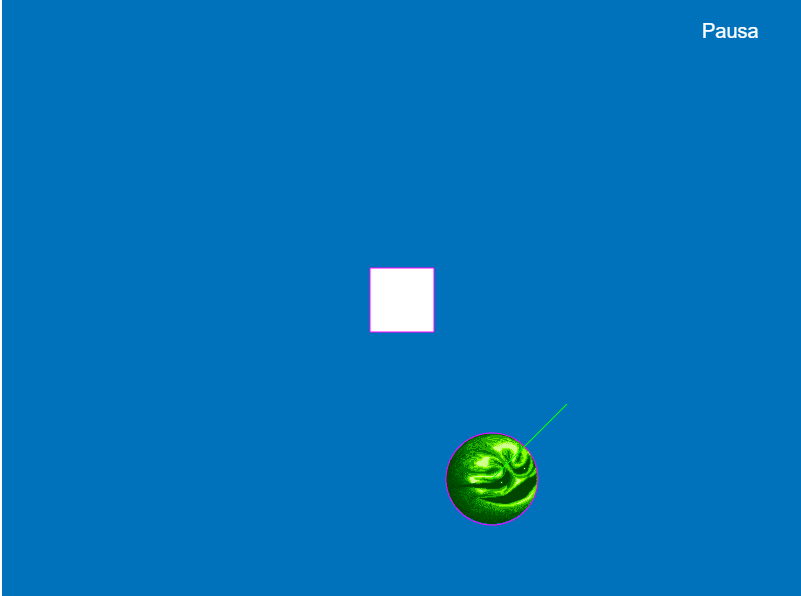

# Actividad: Phaser Bala que rebota

# Entradas y salidas para el juego de Phaser
Para este juego solo tenemos 2 entradas el desplazamiento de la pelota en los ejes X e Y, y de las salidas tenemos 5 estados del jugador que son poderse mover a la izquierda, derecha, arriba y abajo, y el último estado es cuando no hace nada el jugador, con esto la red neuronal sabrá qué hacer cuando la pelota está cerca o lejos.

# Explicación del código
Tenemos la configuración del juego, el tamaño de la ventana del juego, las funciones que va a manejar el juego para que funcione como preload, create y update, y las variables para el funcionamiento del juego como las entradas, salidas, el jugador, el cursor, el menú de pausa, y las variables de la red neuronal.

~~~
// Configuración del juego
const config = {
    type: Phaser.AUTO,
    parent: 'phaser-example',
    backgroundColor: '#0072bc',
    width: 800,
    height: 600,
    physics: {
        default: 'arcade',
        arcade: {
            debug: true
        }
    },
    scene: {
        preload: preload,
        create: create,
        update: update
    }
};

var game = new Phaser.Game(config);
var player, cursors, menu, pausaL;
var statusIzq, statusDer, statusArr, statusAba, statusQuieto;
var despBallx, despBally;
var nnNetwork, nnEntrenamiento, nnSalida, datosEntrenamiento = [];
var modoAuto = false, eCompleto = false;
~~~

## Función preload
Solo carga los sprites de la pelota y el menú.

~~~
function preload() {
    this.load.image('wizball', 'assets/sprites/wizball.png');
    this.load.image('menu', 'assets/game/menu.png');
}
~~~

## Función create
Se ponen los sprites en el juego, en la posición especificada, el jugador solo es un rectángulo blanco, las colisiones con los límites de la pantalla y se inicializa la red neuronal.

~~~
function create() {
    player = this.add.rectangle(400, 300, 64, 64, 0xffffff);
    this.physics.add.existing(player, false);

    cursors = this.input.keyboard.createCursorKeys();

    player.body.setCollideWorldBounds(true);

    ball1 = this.physics.add.image(100, 240, 'wizball');
    ball1.setCircle(46);
    ball1.setCollideWorldBounds(true);
    ball1.setBounce(1);
    ball1.setVelocity(150);

    // Red neuronal
    nnNetwork = new synaptic.Architect.Perceptron(2, 2, 2, 5);
    nnEntrenamiento = new synaptic.Trainer(nnNetwork);

    // Añadir el texto de pausa
    pausaL = this.add.text(700, 20, 'Pausa', { font: '20px Arial', fill: '#fff' });
    pausaL.setInteractive({ useHandCursor: true }); 
    pausaL.on('pointerup', pausa, this); 

    this.input.on('pointerdown', mPausa, this); 
}

~~~

## Funciones de datos de entrenamiento
Los datos de entrenamiento 0 y 1 se enfocan en izquierda y derecha respectivamente, el 2 y 3 se enfocan en arriba y abajo respectivamente, estas funciones se usan para que la red neuronal sea capaz de saber a donde dirigirse en caso de que la pelota este cerca o lejos

~~~
function enRedNeural() {
    nnEntrenamiento.train(datosEntrenamiento, { rate: 0.003, iterations: 10000, shuffle: true });
}

function datosDeEntrenamiento(param_entrada) {
    console.log("Entrada", param_entrada[0] + " " + param_entrada[1]);
    nnSalida = nnNetwork.activate(param_entrada);
    var izquierda = Math.round(nnSalida[0] * 100);
    var derecha = Math.round(nnSalida[1] * 100);
    console.log("Valor ", "En Izquierda %: " + izquierda + " En Derecha %: " + derecha)
    return izquierda > derecha;
}

function datosDeEntrenamiento1(param_entrada) {
    console.log("Entrada", param_entrada[0] + " " + param_entrada[1]);
    nnSalida = nnNetwork.activate(param_entrada);
    var izquierda = Math.round(nnSalida[0] * 100);
    var derecha = Math.round(nnSalida[1] * 100);
    console.log("Valor ", "En Izquierda %: " + izquierda + " En Derecha %: " + derecha)
    return derecha > izquierda;
}

function datosDeEntrenamiento2(param_entrada) {
    console.log("Entrada", param_entrada[0] + " " + param_entrada[1]);
    nnSalida = nnNetwork.activate(param_entrada);
    var Arriba = Math.round(nnSalida[2] * 100);
    var Abajo = Math.round(nnSalida[3] * 100);
    console.log("Valor ", "Hacia Arriba %: " + Arriba + " Hacia abajo %: " + Abajo)
    return Arriba > Abajo;
}

function datosDeEntrenamiento3(param_entrada) {
    console.log("Entrada", param_entrada[0] + " " + param_entrada[1]);
    nnSalida = nnNetwork.activate(param_entrada);
    var Arriba = Math.round(nnSalida[2] * 100);
    var Abajo = Math.round(nnSalida[3] * 100);
    console.log("Valor ", "Hacia Arriba %: " + Arriba + "Hacia abajo %: " + Abajo)
    return Abajo > Arriba;
}

~~~

## Funciones de pausa y reseteo
Es igual que el proyecto anterior, el botón de pausa, el menú y el reseteo del juego, aunque tuve problemas con el posicionamiento de la pelota, y que dejara de moverse.

~~~
function pausa() {
    game.paused = true;
    menu = this.add.sprite(400, 300, 'menu');
    menu.setOrigin(0.5, 0.5);
    player.body.setVelocity(0, 0);
    player.setPosition(50, player.y);
}

function mPausa(event) {
    if (game.paused) {
        var menu_x1 = 800 / 2 - 135, menu_x2 = 800 / 2 + 135,
            menu_y1 = 600 / 2 - 90, menu_y2 = 600 / 2 + 90;

        var mouse_x = event.x,
            mouse_y = event.y;

        if (mouse_x > menu_x1 && mouse_x < menu_x2 && mouse_y > menu_y1 && mouse_y < menu_y2) {
            if (mouse_x >= menu_x1 && mouse_x <= menu_x2 && mouse_y >= menu_y1 && mouse_y <= menu_y1 + 90) {
                eCompleto = false;
                datosEntrenamiento = [];
                modoAuto = false;
            } else if (mouse_x >= menu_x1 && mouse_x <= menu_x2 && mouse_y >= menu_y1 + 90 && mouse_y <= menu_y2) {
                if (!eCompleto) {
                    enRedNeural();
                    eCompleto = true;
                }
                modoAuto = true;
            }

            menu.destroy();
            resetVariables();
            game.paused = false;
        }
    }
}

function resetVariables() {
    player.body.position.x = 400;
    player.body.position.y = 300;
    player.body.velocity.x = 0;
    player.body.velocity.y = 0;
    ball1.body.position.x = 0;
}
~~~

## Función Update
Los valores iniciales de las banderas de estado del jugador, la colisión entre el jugador y la pelota, el modo manual cambiando las banderas de estado con las acciones que realice el jugador, guardando las acciones para el entrenamiento de la red neuronal, el desplazamiento de la pelota en los ejes X e Y, y el modo automático para que la red neuronal pueda controlar al jugador.

~~~
function update() {
    statusQuieto = 1;
    statusArr = 0;
    statusDer = 0;
    statusIzq = 0;
    statusAba = 0;

    this.physics.world.collide(ball1, player, colisionH, null, this);

    player.body.setVelocity(0);

    //Modo manual
    if (!modoAuto && cursors.left.isDown) {
        statusQuieto = 0;
        statusIzq = 1;
        player.body.setVelocityX(-300);
    } else if (!modoAuto && cursors.right.isDown) {
        statusQuieto = 0;
        statusDer = 1;
        player.body.setVelocityX(300);
    }

    if (!modoAuto && cursors.up.isDown) {
        statusQuieto = 0;
        statusArr = 1;
        player.body.setVelocityY(-300);
    } else if (!modoAuto && cursors.down.isDown) {
        statusQuieto = 0;
        statusAba = 1;
        player.body.setVelocityY(300);
    }

    despBallx = Math.floor(player.x - ball1.x);
    despBally = Math.floor(player.y - ball1.y);

    if (modoAuto) {
        // Iazquierda
        if (datosDeEntrenamiento([despBallx, despBally])) {
            player.body.setVelocityX(-300);
        }
        //Derecha
        if (datosDeEntrenamiento1([despBallx, despBally])) {
            player.body.setVelocityX(300);
        }
        //Arriba
        if (datosDeEntrenamiento2([despBallx, despBally])) {
            player.body.setVelocityY(-300);
        }
        //Abajo
        if (datosDeEntrenamiento3([despBallx, despBally])) {
            player.body.setVelocityY(300);
        }
    }

    if (!modoAuto) {
        datosEntrenamiento.push({
            'input': [despBallx, despBally],
            'output': [statusIzq, statusDer, statusArr, statusAba, statusQuieto]
        });
        console.log("Desplazamiento en X: " + despBallx + " Desplazamiento en Y: " + despBally + " Izquierda: " + statusIzq + " Derecha: " + statusDer + " Arriba: " + statusArr + " Abajo: " + statusAba + " Quieto: " + statusQuieto);
    }
}

function colisionH() {
    pausa.call(this);
}
~~~